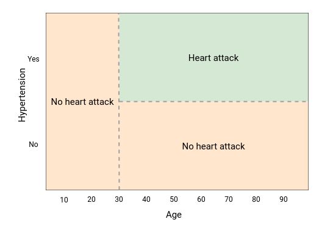

```{r setup, include=FALSE}
knitr::opts_chunk$set(echo = TRUE, message = FALSE, warning = FALSE)
```

```{r include=FALSE}
library(dplyr)
library(ggplot2)
library(viridis)
set.seed(40)
theme_set(theme_minimal())

col_palette <- list()
col_palette$green <- '#23754f'
col_palette$red <- '#ba1827'

# # set default continuous colors
# options(
#   ggplot2.continuous.colour = "viridis",
#   ggplot2.continuous.fill = "viridis"
# )
# 
# # set default discrete colors
# scale_colour_discrete <- function(...) {
#   viridis::scale_color_viridis(..., discrete = TRUE)
# }
# scale_color_discrete <- function(...) {
#   viridis::scale_color_viridis(..., discrete = TRUE)
# }
# scale_fill_discrete <- function(...) {
#   viridis::scale_fill_viridis(..., discrete = TRUE)
# }
```

<br>

## Motivation
### Parametric vs non-parametric.

What if you had data that looked like this? It's square, there's clear edges that define the classes and it's non-linear. It would be difficult to mathematically represent this data using a linear model like linear regression, logistic regression, glm, etc.

```{r para-class, echo=FALSE}
# create a two dimensional dataset
# create a two dimensional dataset
n <- 1000
.data <- tibble(X1 = runif(n, -1, 1),
                X2 = runif(n, -1, 1),
                Y = (round(X1) == round(X2)) * 1)

# plot it
.data %>% 
  mutate(Y = paste0("Class ", Y)) %>% 
  ggplot(aes(x = X1, y = X2, shape = Y)) +
  geom_point(size = 3, alpha = 0.5) +
  scale_shape_manual(values = c(1, 19)) +
  labs(shape = NULL)
```
<br><br><br><br>

You could fit a logistic regression to this model.

```{r}
mod <- glm(Y ~ X1 + X2, data = .data, family = 'binomial')
preds <- predict(mod, type = 'response') > 0.5
```

```{r echo=FALSE}
plot_classes <- function(.data, preds){
  .data %>% 
    mutate(preds = as.numeric(preds),
           correct = if_else(preds == Y, 'Correct', 'Incorrect'),
           Y = paste0("Class ", Y)) %>% 
    ggplot(aes(x = X1, y = X2, shape = Y, color = correct)) +
    geom_point(size = 3, alpha = 0.5) +
    scale_shape_manual(values = c(1, 19)) +
    scale_color_manual(values = c(col_palette$green, col_palette$red)) +
    labs(shape = NULL, color = NULL)
}

plot_classes(.data, preds)
```

<br><br><br><br>

And if you know exactly what you were doing, you could add an interaction and get slightly better results.

```{r}
mod <- glm(Y ~ X1 * X2, data = .data, family = 'binomial')
preds <- predict(mod, type = 'response') > 0.5
```

```{r echo=FALSE}
plot_classes(.data, preds)
```
<br><br><br><br>

But knowing that functional form is difficult, especially in real-world high-dimensional datasets. Decision trees over 


```{r}
mod_tree <- rpart::rpart(Y ~ X1 + X2, data = .data)
preds <- predict(mod_tree) > 0.5
```

```{r echo=FALSE}
plot_classes(.data, preds)
```

<br><br><br><br>

## Decision trees

We will start at the lowest building block of the decision trees – the impurity metric – and build up from there.

1. Define an impurity metric which drives each split in the decision tree
2. Program a decision algorithm to choose the best data split based on the impurity measure
3. Program a decision tree algorithm by recursively calling the decision algorithm

And then you can extend the tree model into more complex models like bagging, random forest, and XGBoost:
4. Program a bagging model by implementing many decision trees and resampling the data
5. Program a random forest model by implementing many decision trees, resampling the data, and sampling from the columns
6. XGB

### Intuition

Binary decision trees create an interpretable decision-making framework for making a single prediction. Suppose a patient comes into your clinic with chest pain and you wish to diagnose them with either a heart attack or not a heart attack. A simple framework of coming to that diagnosis could look like the below diagram. Note that each split results in two outcomes (binary) and every possible condition leads to a terminal node.


The model’s splits can also be visualized as partitioning the feature space. Since the decision tree makes binary splits along a feature, the resulting boundaries will always be rectangular. Further growing of the above decision tree will result in more but smaller boxes. Additional features (`X1, X2, ...`) will result in additional dimensions to the plot.



But where to split the data? The splits are determined via an impurity index. With each split, the algorithm maximizes the purity of the resulting data. If a potential split results in classes `[HA, HA]` and `[NHA, NHA]` then that is chosen over another split that results in `[HA, NHA]` and `[NHA, HA]`. At each node, all possible splits are tested and the split that maximizes purity is chosen.

For classification problems, a commonly used metric is Gini impurity. Gini impurity is `2 * p * (1 - p)` where `p` is the fraction of elements labeled as the class of interest. A value of `0` is a completely homogeneous vector while 0.5 is the inverse. The vector [NHA, HA, NHA] has a Gini value of `2 * 1/3 * 2/3 = 0.444`. Since Gini is used for comparing splits, a Gini value is calculated per each resulting vector and then averaged – weighted by the respective lengths of the two vectors.

### Where trees struggle

Trees will struggle when the parameter space is dissected at an angle by the classification value. Since regression trees are partitioning the parameter space into rectangles, the tree will need to be deeper to approximate the decision boundary.

The below data's classification is in two separate triangles: top left and bottom right of the plot. A logistic regression finds the boundary easily.

```{r echo=FALSE}
# create a two dimensional dataset
n <- 1000
.data <- tibble(X1 = runif(n, 0, 1),
                X2 = runif(n, 0, 1),
                Y = (X1 > X2) * 1)
# plot it
.data %>% 
  mutate(Y = paste0("Class ", Y)) %>% 
  ggplot(aes(x = X1, y = X2, shape = Y)) +
  geom_point(size = 3, alpha = 0.5) +
  scale_shape_manual(values = c(1, 19)) +
  labs(shape = NULL)
```
<br><br><br><br>

```{r}
# decision tree
mod_tree <- rpart::rpart(Y ~ X1 + X2, data = .data, control = rpart::rpart.control(maxdepth = 2))
preds <- predict(mod_tree) > 0.5
```

```{r echo=FALSE}
# mod_tree
plot_classes(.data, preds) +
  geom_vline(xintercept = 0.5) +
  geom_segment(x = 0, xend = 0.5, y = 0.35, yend = 0.35) +
  geom_segment(x = 0.5, xend = 1, y = 0.73, yend = 0.73)
```
<br><br><br><br>

```{r}
# logistic regression
model_log <- glm(Y ~ X1 + X2, data = .data, family = 'binomial')
preds <- predict(model_log, type = 'response') > 0.5 
```

```{r echo=FALSE}
plot_classes(.data, preds) +
  geom_abline(slope = 1, intercept = 0)
```
<br><br><br><br>

## Bagging

Single decision trees are prone to overfitting and can have high variance on new data. A simple solution is to create many decision trees based on resamples of the data and allow each tree to “vote” on the final classification. This is bagging. The process keeps the low-bias of the single tree model but reduces overall variance.

The “vote” from each tree is their prediction for a given observation. The votes are averaged across all the trees and the final classification is determined from this average. The trees are trained on bootstrapped data – taking repeated samples of the training data with replacement.

## Random forest

Random forest is like bagging except in addition to bootstrapping the observations, you also take a random subset of the features at each split. The rule-of-thumb sample size is the square root of the total number of features.

## XGBoost


## Model comparison on real world data

```{r}
credit <- readr::read_csv(file.path(here::here(), 'workshop', 'data', 'credit_card.csv'))

X <- select(credit, -Class)
Y <- credit$Class

# create train test split
indices <- sample(c(TRUE, FALSE), size = nrow(credit), replace = TRUE, prob = c(0.5, 0.5))
X_train <- X[indices,]
X_test <- X[!indices,]
Y_train <- Y[indices]
Y_test <- Y[!indices]
```

```{r}
# fit the bagged model
# preds <- bag_it(X_train, Y_train, X_test, n_trees = 50, max_depth = 10, gini_threshold = 0, min_observations = 5)
# table(preds > 0.5, Y_test)
```


```{r}
# fit a random forest
model_ranger <- ranger::ranger(Class ~ ., data = credit[indices,], num.trees = 50, max.depth = 10)
preds <- predict(model_ranger, data = credit[!indices,])$predictions
table(preds > 0.5, credit$Class[!indices])
```

```{r}
# fit an xgb

```

### How to do this smartly in practice

tidymodels and tuning

```{r}
# tidymodels

```


## Bayesian Additive Regression Trees (BART)

### Bayesian vs frequentist primer

### Fitting a bart model

tidymodels

### BART for causal inference

bartCause


https://priism-center.github.io/thinkCausal_dev/d3/bart/


<br>

## Final thoughts

**Benefits of tree methods**:

- Single trees are easy to explain and interpret
- Allows for both classification and regression
  - For regression, replace the Gini impurity measure with variance of the outcome variable
- Allows for binary, continuous, and categorical (with dummy coding) variables
- Can handle missing data (if data is not used within a branch)
- Ensemble methods are computationally parallelizable


**Downsides**:  

- Single trees are easy to overfit  
- Single trees have high variance  
- Ensemble methods are difficult to interpret  
